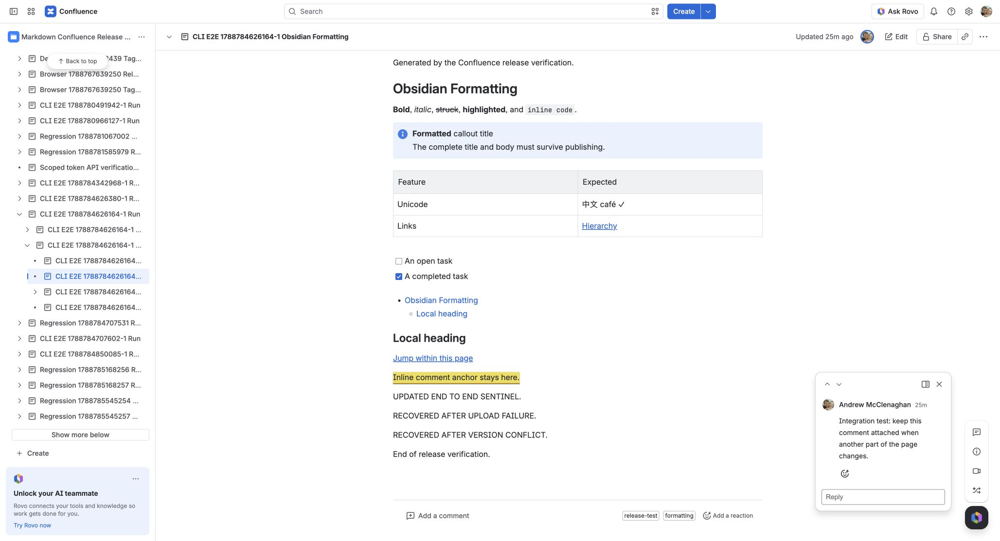

# Cloud API and authentication verification

The publisher uses `confluence.js` 3.2.0 with one shared transport in the CLI,
container and desktop Obsidian plugin. Cloud is the supported target. The SDK
maintainer confirms that v1 and v2 remain complementary; the migration does not
replace operations for which v2 has no equivalent. See the
[maintainer's update](https://github.com/MrRefactoring/confluence.js/issues/38#issuecomment-5023677731)
and [SDK migration guide](https://github.com/MrRefactoring/confluence.js/blob/master/MIGRATION.md).

## Library migration from 6

This is a **major release** because the public client contract changes. Existing
Markdown, page IDs and standard publishing settings continue to work.

The library now uses `confluence.js` 3.2.0. All authentication modes use REST v2 for pages, blog posts, spaces, ancestors, attachment reads and label reads. Current-user lookup, multipart attachment uploads and label writes retain supported v1 endpoints. The route and authentication matrix follows below.

Custom client integrations must migrate to the v3 SDK contract. `createConfluenceClientConfig` returns `ClientConfig` with `host`, `auth` and `headers`; the old `authentication`, `apiPrefix`, Axios configuration and middleware fields are no longer supported. Prefer `createAuthenticatedConfluenceClient(settings, { fetch })` for an injected transport; the old `createClient` override is removed. Direct `sendRequest` calls use SDK v3 `body` and `searchParams`, rather than Axios `data` and `params`. Multipart uploads use native `FormData` and `Blob`. `RequiredConfluenceClient` exposes publisher models instead of the removed SDK v2 `Api`, `Models` and `Parameters` namespaces.

`confluenceApiPrefix`, `DEFAULT_CONFLUENCE_API_PREFIX` and `normalizeConfluenceApiPrefix` remain as deprecated compatibility fields/exports. Endpoint paths are supplied by the SDK; these values no longer change routing.

## Endpoint coverage

| Operation | REST version | Reason |
| --- | --- | --- |
| Find, read, create and update pages | v2 | Supported page endpoints, including ADF bodies |
| Find, read, create and update blog posts | v2 | Supported blog-post endpoints; space must enable Blogs |
| Resolve spaces and page ancestors | v2 | Space IDs and complete ancestor traversal |
| Read page/blog attachments and labels | v2 | Cursor pagination and unchanged-upload detection |
| Upload or replace attachments | v1 | Multipart upload; retains MD5 comment, filename and media type |
| Add and remove labels | v1 | Supported write endpoints |
| Identify the publishing user | v1 | Current-user endpoint and overwrite protection |
| Seed and inspect inline comments in tests | v2 | Independent fixture operation; publishing preserves ADF annotations |

Both REST clients use the same credentials, HTTPS validation, redirect rejection,
response validation and desktop transport. Transient network failures retry reads
only. Rate-limit retries honour `Retry-After`; multipart writes are never replayed
automatically. Errors omit request configuration and credentials.

## Authentication coverage

Verified on 2026-09-07 against the dedicated `MCRT20260907` space. “Passed” means
real Confluence operations, including a changed publish and an unchanged republish.

| Authentication | API destination | CLI page suite | Blog CLI suite | Obsidian + Dataview | Container regression |
| --- | --- | --- | --- | --- | --- |
| Scoped API token + email | Atlassian gateway | Passed | Passed | Passed | Passed: 166 notes, 17 Mermaid diagrams |
| Unscoped API token + email | Site origin and gateway | Passed on both | Passed on site origin | Passed on gateway | Passed: two-note fixture |
| Service-account OAuth | Atlassian gateway | Passed | Passed | Token exchange, parent/blog access and attachment/label reads passed in the real plugin | Passed: two-note fixture |
| Native browser OAuth | Atlassian gateway | Shared transport covered by service-account suite | Shared publishing path | Passed, including real rotating refresh tokens | Not a container login method |

The small container fixture retains all image variants, inline-comment checks and
both diagram failure/recovery cases. The scale test runs separately to avoid
repeating 166-note uploads for every credential. Obsidian publishing uses the
vault's selected credentials; its independent API verifier may use another test
account. This does not substitute credentials in the plugin.

The scoped token used the ten scopes listed in [Cloud OAuth](CLOUD_OAUTH.md).
Those scopes passed the listed page and blog operations on this test site.
Space permissions still apply: Blogs had to be enabled, and the OAuth service
account needed blog-post creation permission in the dedicated test space.

## Feature acceptance

| Feature | Concrete verification |
| --- | --- |
| Formatting and conversion | Built CLI matches the library for all Markdown fixtures; file/stdin input and file/stdout output; exact rich ADF round trip; live export by page ID and URL |
| Selection and hierarchy | Publish folder, tags, explicit include/exclude, folder notes and parent relationships |
| Embeds and macros | Heading/block embeds, rebased assets, literal code examples, TOC, headers and footers |
| Images and attachments | PNG/SVG, files, spaces, encoded spaces, parentheses, Unicode, wiki embeds and remote images; unchanged attachment IDs/versions |
| Diagrams | Real Chromium and Electron Mermaid, real PlantUML in live/desktop tests; invalid syntax and protocol timeout fail, then recover |
| Labels and blog posts | Create, add/remove labels, update, unchanged republish, attachments and CLI ADF file export |
| Existing inline comments | Real comment ID, body, open status, marker and original highlighted text survive an edit elsewhere; another publish leaves the page version unchanged |
| Conflict and error handling | Duplicate titles and missing embeds reject without page writes; upload failure recovery and real HTTP 409 version conflict |
| Dataview | TABLE/LIST/TASK output, links, embedded context, source/query preservation, dependency-only updates, unchanged versions and invalid-query protection |
| Native OAuth lifecycle | Browser consent, site selection, parent access, refresh rotation and SecretStorage in real Obsidian; callback/polling cancellation and failure paths in automated protocol tests |
| Distribution artifacts | Five packed npm packages in a fresh consumer, ESM/CommonJS dynamic import, CLI, Obsidian artifacts and candidate container |

The inline-comment test found and fixed an empty trailing ADF text node when the
comment selected the end of a paragraph. Confluence removed that node on storage,
causing repeated version increments. Unit tests cover whole-paragraph and
end-of-paragraph anchors, and live CLI, desktop and container runs verify the fix.

## Limits and repeatability

Atlassian has not enabled the device grant for the registered app. The plugin's
device-code UI and protocol paths pass controlled tests, but a successful real
device-code login remains unverified until Atlassian enables the client. Native
browser login with the configured app secret works without a hosted service.
See [Obsidian OAuth](OBSIDIAN_OAUTH.md) for onboarding and distribution limits.

Local container verification does not certify published multi-architecture images
or update companion Action tags. CI verifies the candidate on Linux and Windows;
release publication remains a separate workflow. Blog-specific assertions run
through the built CLI; Obsidian and the container share its library adapter.

Use the commands in [Testing](TESTING.md) to repeat the matrix. Reports include
timings, page IDs, comment evidence and checks under
`reports/integration/<profile>-<timestamp>-<unique-id>/`. Reports and credentials
are ignored by Git. Remote synthetic pages remain in the dedicated space for
inspection.
