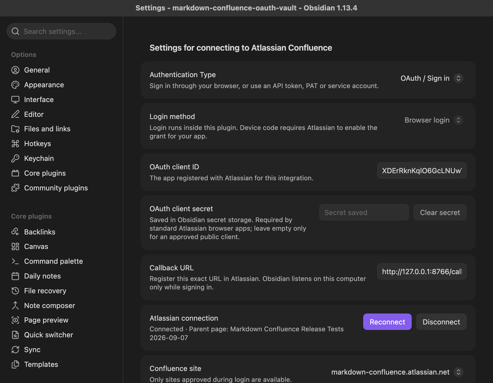

# Obsidian OAuth

Cloud service-account OAuth, browser login and device-code login run in the desktop
plugin. No separately hosted OAuth service is required. Scoped and unscoped Cloud
API tokens also remain available. Confluence Server and Data Center are unsupported.

## Interactive login

Choose **OAuth / Sign in** in Confluence Integration settings. Enter the registered
OAuth app's **client ID** and, if the registration requires it, its **client secret**.
The plugin stores the secret and rotating tokens in Obsidian's `SecretStorage` API
(requires Obsidian 1.11.4 or newer). The secret field is masked and does not reveal a
previously saved value. **Clear secret** removes it after disconnecting.

### Browser login

1. Choose **Browser login**.
2. Register the exact **Callback URL** in the Atlassian app's Authorization settings.
   The default is `http://127.0.0.1:8766/callback`; another explicit port is supported.
3. Click **Connect to Atlassian**, approve the site in the browser, and return to
   Obsidian. **Open browser** reopens the pending authorization if needed.
4. Select the Confluence site, enter the **Confluence Parent Page ID**, and click
   **Test connection** to verify parent-page access before publishing.



Obsidian opens a temporary listener on `127.0.0.1` only while signing in. The listener
validates OAuth state, Host, Origin, method and path, accepts the callback once, and
closes after success, denial, cancellation or timeout. S256 PKCE binds the code to
this login. The plugin exchanges the code directly with Atlassian over HTTPS;
access tokens, refresh tokens and client secrets never appear in browser URLs.
A busy callback port produces an actionable error. Multiple vaults can use different
registered callback ports if simultaneous login is required.

Standard Atlassian developer-console registrations currently require a secret.
Leaving it empty is supported for an approved public client, but secret-free
browser authorization has not been verified with our current registration.

### Device code

Choose **Device code**, then **Connect to Atlassian**. When enabled for the client,
the plugin displays the user code, opens Atlassian's verification page, and polls
the token endpoint. **Copy code**, **Open browser** and **Cancel login** are available
while waiting. Polling honours the returned interval (five seconds by default),
increases it on `slow_down` or HTTP 429, backs off after network failures and stops
on approval, denial, cancellation or expiry. No callback listener is used.

On 2026-09-07, Atlassian discovery advertised
`https://auth.atlassian.com/oauth/device/code`, but our registered app returned:

```json
{"error":"invalid_client","error_description":"grant_type is not enabled for client"}
```

The plugin explains this limitation and suggests browser login or Atlassian
activation. Device-flow protocol behaviour is tested using controlled responses;
a successful live device grant and secret-free refresh require an enabled client
from Atlassian. Do not interpret a passing simulated test as live enablement.

## Connection lifecycle

Only Confluence sites returned by Atlassian with the required read scope appear in
the selector. The selected site must match the publishing destination. Tokens are
bound to the client ID, credential identifier, flow and browser callback. Disconnect
before editing these settings; an earlier login cannot be reused for another app.

Refresh happens before publishing when needed. Concurrent requests share one
refresh operation, and the replacement refresh token is saved immediately.
Cancellation, disconnect or configuration changes cannot restore credentials from
an older operation. Disconnect clears this vault's access and refresh tokens;
the app secret remains available for reconnect and can be removed separately.
Revoke the app under your Atlassian account's connected apps to remove the remote
grant. Reconnect on another device instead of sharing rotating refresh tokens.

## App registration and distribution

The registered Atlassian app needs the Confluence scopes in
`packages/obsidian/src/AtlassianOAuth.ts`, plus `offline_access` during authorization.
Resource-level grants restrict access to sites selected at consent. No shared
client secret is embedded in the distributed plugin.

After adding scopes to an existing app registration, use **Reconnect** and accept
the updated grant. Refreshing an existing token does not add new permissions.
Page edit locking requires both `read:content.restriction:confluence` and
`write:content.restriction:confluence` in the app registration and user grant.

Atlassian's [current guidance](https://developer.atlassian.com/cloud/confluence/oauth-2-3lo-apps/)
states that integrations instructing customers to create individual 3LO apps do not
comply with its requirements. The configurable credentials support integration
verification; the maintainer is discussing public-client registration and device
grant enablement with Atlassian before choosing public onboarding.

Our current app's local browser flow with a configured secret works against real
Confluence. Its distribution remains private. Device enablement and public-client
support are tracked by [ECO-1378](https://jira.atlassian.com/browse/ECO-1378) and
[ECO-283](https://jira.atlassian.com/browse/ECO-283).

References: [Atlassian 3LO](https://developer.atlassian.com/cloud/confluence/oauth-2-3lo-apps/),
[OAuth discovery](https://auth.atlassian.com/.well-known/openid-configuration),
[RFC 8628](https://www.rfc-editor.org/rfc/rfc8628),
[native OAuth](https://www.rfc-editor.org/rfc/rfc8252).

## Service accounts

Choose **OAuth / Service account**. Enter the client ID and secret issued in
Atlassian Administration, the gateway API URL
`https://api.atlassian.com/ex/confluence/CLOUD_ID`, browsable site URL and parent
page ID. See [Cloud OAuth](CLOUD_OAUTH.md) for scopes and account permissions.
A fresh access token is requested when publishing. Service-account secrets follow
the existing plugin credential settings storage; exclude those settings from
shared backups and source control.

## Repeat the integration tests

```sh
vp test run packages/obsidian/src/BrowserOAuth.test.ts packages/obsidian/src/AtlassianOAuth.test.ts packages/obsidian/src/OAuthCallback.test.ts
CONFLUENCE_E2E_AUTH_TYPE=oauth2 vp run test:integration obsidian --vault ../markdown-confluence-oauth-vault
```

Unit and loopback integration tests run without a build or Atlassian credentials.
They cover the protocol and callback failure paths, secret storage and refresh
races. The desktop harness preserves the vault's selected login method and checks
the installed plugin in the real Obsidian runtime. Its independent API verifier
uses service-account credentials from `.env.integration`; publishing uses the
vault's selected authentication.

The harness forces stored interactive tokens to expire and verifies real refresh
rotation and storage outside plugin settings. It checks create, unchanged republish,
update and restore, with Electron Mermaid, PlantUML, images, attachments, labels,
selection and hierarchy. Add `--dataview` to include Dataview when installed in the
vault. Use distinct fixture titles for different publishing accounts so overwrite
protection remains active. Initial consent is interactive; subsequent tests reuse
and refresh the saved login.

The same desktop run exercises device-code controls against a simulated authority:
visible code, masked secret, reopening the browser, cancellation, retry, approval,
site selection and disconnect. A separate real request checks whether Atlassian
has enabled the device grant for the configured app. Both checks use temporary
in-memory state and preserve the working login. Their results are saved in
`oauth.json`, separately from publishing and Dataview results.
