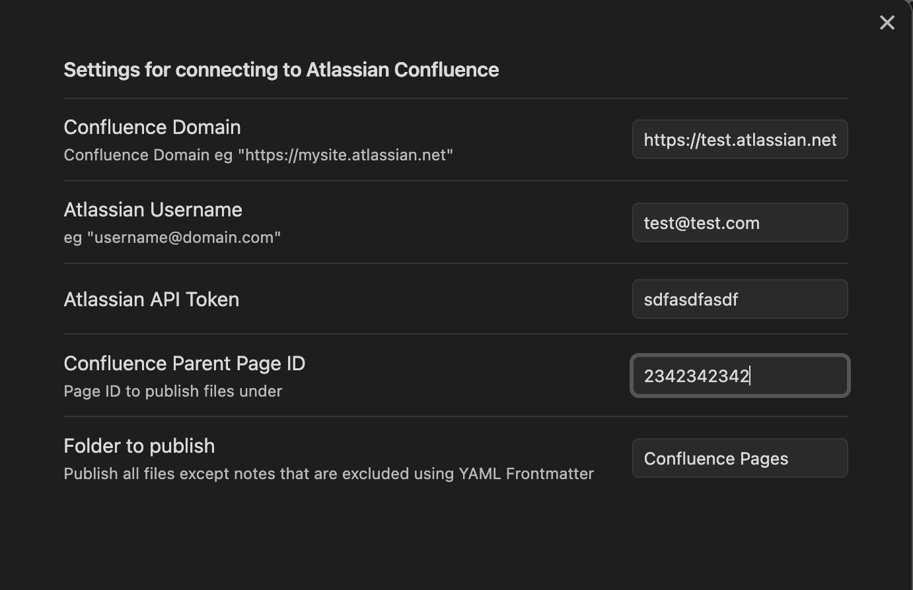
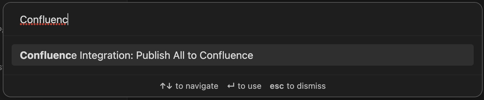

# Obsidian Confluence Integration Plugin

[](https://api.securityscorecards.dev/projects/github.com/markdown-confluence/markdown-confluence)

Copyright (c) 2022 Atlassian Pty Ltd

Copyright (c) 2022 Atlassian US, Inc.

`Obsidian Confluence Integration Plugin` is an open-source plugin for [Obsidian.md](https://obsidian.md/) that allows you to publish markdown content from Obsidian to [Atlassian Confluence](https://www.atlassian.com/software/confluence). It supports [Obsidian markdown extensions](https://help.obsidian.md/How+to/Format+your+notes) for richer content and includes a CLI for pushing markdown files from the command line. Currently, the plugin only supports Atlassian Cloud instances.

## Features

- Publish Obsidian notes to Atlassian Confluence
- Support for Obsidian markdown extensions
- CLI for pushing markdown files from disk
- Commands and ribbon icon for easy access

## Issues
Please log issues to https://github.com/markdown-confluence/markdown-confluence/issues as this is where the code is being developed. 

## Getting Started

1. Install the `confluence-integration` plugin from Obsidian's community plugins browser.
2. Open the plugin settings and configure the following fields:

- `Confluence Base URL`: The base URL of your Atlassian Confluence instance (e.g., `https://your-domain.atlassian.net`)
- `Confluence Parent Id`: The Confluence page ID where your notes will be published as child pages
- `Atlassian User Name`: Your Atlassian account's email address
- `Atlassian API Token`: Your Atlassian API token. You can generate one from your [Atlassian Account Settings](https://id.atlassian.com/manage-profile/security/api-tokens).
- `Folder To Publish`: The name of the folder in Obsidian containing the notes you want to publish (default: "Confluence Pages")



## Usage

### Ribbon Icon

Click the cloud icon in the ribbon to publish the notes from the configured folder to Confluence.


### Commands

Use the command palette (`Ctrl/Cmd + P`) to execute the "Publish All to Confluence" command, which publishes all the notes from the configured folder to Confluence.



### connie-publish Frontmatter

To publish pages outside the `folderToPublish`, add the `connie-publish` YAML frontmatter to your notes:

```yaml
---
connie-publish: true
---
```

### Example Workflow
1. Install and configure the `confluence-integration` plugin.
2. Create a folder in your Obsidian vault named "Confluence Pages" (or the folder name you specified in the settings).
3. Add notes to this folder or add the connie-publish frontmatter to other notes.
4. Click the cloud icon in the ribbon or use the "Publish All to Confluence" command to publish your notes to Confluence.

### Contributing
Contributions are welcome! If you have a feature request, bug report, or want to improve the plugin, please open an issue or submit a pull request on the GitHub repository.

### License
This project is licensed under the [Apache 2.0](https://github.com/markdown-confluence/markdown-confluence/blob/main/LICENSE) License.

## Disclaimer:
The Apache license is only applicable to the Obsidian Confluence Integration (“Integration“), not to any third parties' services, websites, content or platforms that this Integration may enable you to connect with.  In another word, there is no license granted to you by the above identified licensor(s) to access any third-party services, websites, content, or platforms.  You are solely responsible for obtaining licenses from such third parties to use and access their services and to comply with their license terms. Please do not disclose any passwords, credentials, or tokens to any third-party service in your contribution to this Obsidian Confluence Integration project.”
