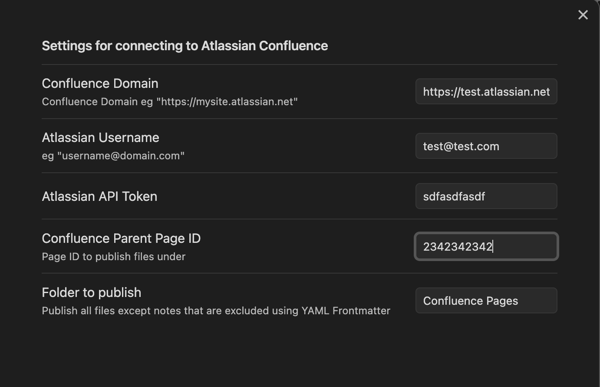
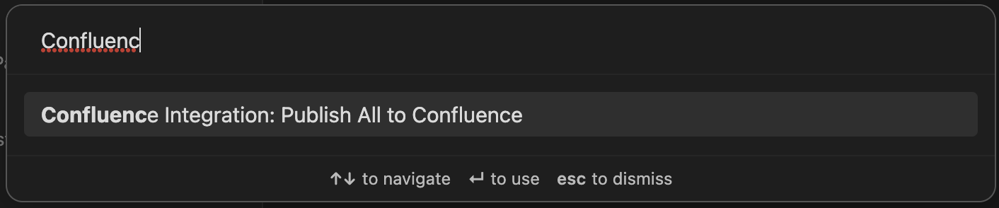

# Obsidian Confluence Integration Plugin

[](https://api.securityscorecards.dev/projects/github.com/markdown-confluence/markdown-confluence)

Copyright (c) 2022 Atlassian Pty Ltd

Copyright (c) 2022 Atlassian US, Inc.

`Obsidian Confluence Integration Plugin` is an open-source plugin for [Obsidian.md](https://obsidian.md/) that allows you to publish markdown content from Obsidian to [Atlassian Confluence](https://www.atlassian.com/software/confluence). It supports [Obsidian markdown extensions](https://help.obsidian.md/How+to/Format+your+notes) for richer content and includes a CLI for pushing markdown files from the command line. Currently, the plugin only supports Atlassian Cloud instances.

## Features

- Publish Obsidian notes to Atlassian Confluence
- Support for Obsidian markdown extensions
- Mermaid and PlantUML diagram rendering
- Optional [Dataview TABLE, LIST and TASK publication](../../documentation/DATAVIEW.md)
- CLI for pushing markdown files from disk
- Commands and ribbon icon for easy access

## PlantUML support

Fenced code blocks tagged `plantuml`, `puml`, or `uml` are rendered to PNG via a PlantUML server and uploaded as page attachments, followed by a collapsible "source" section with the raw diagram text. `![[diagram.puml]]` wikilink embeds are resolved too. PlantUML rendering is disabled by default. Enable it in settings and configure a server you trust to receive diagram source. You can run a local server (`docker run -d -p 8080:8080 plantuml/plantuml-server:jetty`) and use `http://localhost:8080`.

## Issues
Please log issues to https://github.com/markdown-confluence/markdown-confluence/issues as this is where the code is being developed. 

## Getting Started

1. Download `main.js` and `manifest.json` from the [Obsidian integration releases](https://github.com/markdown-confluence/obsidian-integration/releases). Create `.obsidian/plugins/confluence-integration` inside your vault and place both files there. Restart Obsidian, enable community plugins for the vault, and enable **Confluence Integration**. This plugin is currently absent from the community catalog; a GitHub release does not restore that listing.
2. Open the plugin settings and configure the following fields:

- `Confluence API URL`: Your Confluence site (e.g., `https://your-domain.atlassian.net`), or `https://api.atlassian.com/ex/confluence/{cloudId}` for scoped API tokens.
- `Confluence Site URL`: The browsable site URL. Required when using the API gateway so published links point to your site.
- `Confluence Parent Id`: The Confluence page ID where your notes will be published as child pages
- `Atlassian User Name`: Your Atlassian account's email address
- `Atlassian API Token`: Your Atlassian API token. You can generate one from your [Atlassian Account Settings](https://id.atlassian.com/manage-profile/security/api-tokens).
- `Authentication Type`: API token / Basic for Confluence Cloud API tokens, including scoped tokens; Bearer / PAT for bearer-token endpoints.
- `Custom Request Headers`: Optional JSON object of extra headers to send with Confluence requests.
- `Folder To Publish`: The name of the folder in Obsidian containing the notes you want to publish (default: "Confluence Pages")
- `Tags to publish`: Optional comma-separated YAML tags. Notes with a matching `tags` value are published even when they are outside the configured folder.



## Usage

### Ribbon Icon

Click the cloud icon in the ribbon to publish the notes from the configured folder to Confluence.


### Commands

Use the command palette (`Ctrl/Cmd + P`) to execute the "Publish All to Confluence" command, which publishes all the notes from the configured folder to Confluence.



### connie-publish Frontmatter

To publish pages outside the `folderToPublish`, add the `connie-publish` YAML frontmatter to your notes:

```yaml
---
connie-publish: true
---
```

Publishing also writes the generated Confluence URL to `connie-page-url`, next to the existing `connie-page-id`, so you can navigate back to the published page from the note properties.

### Publishing by Tag

Set `Tags to publish` to a comma-separated list such as `docs, public` to publish notes whose YAML `tags` frontmatter contains one of those tags. `connie-publish: false` still excludes a note, even if it has a matching tag.

```yaml
---
tags:
  - public
---
```

### Embedded Notes

Obsidian note embeds are expanded before publishing, so a published note can include content from another Markdown note that lives outside the configured publish folder:

```markdown
![[Shared Notes/Release Checklist]]
```

### Example Workflow
1. Install and configure the `confluence-integration` plugin.
2. Create a folder in your Obsidian vault named "Confluence Pages" (or the folder name you specified in the settings).
3. Add notes to this folder or add the connie-publish frontmatter to other notes.
4. Click the cloud icon in the ribbon or use the "Publish All to Confluence" command to publish your notes to Confluence.

### Publishing hierarchy

The configured `Confluence Parent Id` represents the root of the selected local publishing tree. When all selected notes are inside `Folder To Publish`, that folder is not created as an extra child page. Selecting notes in other folders through tags or `connie-publish: true` expands the tree root to their common parent, so the selected folders become child pages.

To publish the root parent page's content from Obsidian, add a folder note at the root of `Folder To Publish`. The folder note can be named the same as the folder, `index.md`, `README.md`, or `readme.md`. Subfolders use the same folder-note names for their folder pages.

Pages created directly in Confluence are not imported into Obsidian or published automatically. To manage an existing Confluence page from Obsidian, create a local note and set its `connie-page-id` frontmatter to the Confluence page ID.

### Contributing
Contributions are welcome! If you have a feature request, bug report, or want to improve the plugin, please open an issue or submit a pull request on the GitHub repository.

### License
This project is licensed under the [Apache 2.0](https://github.com/markdown-confluence/markdown-confluence/blob/main/LICENSE) License.

## Disclaimer:
The Apache license is only applicable to the Obsidian Confluence Integration (“Integration“), not to any third parties' services, websites, content or platforms that this Integration may enable you to connect with.  In another word, there is no license granted to you by the above identified licensor(s) to access any third-party services, websites, content, or platforms.  You are solely responsible for obtaining licenses from such third parties to use and access their services and to comply with their license terms. Please do not disclose any passwords, credentials, or tokens to any third-party service in your contribution to this Obsidian Confluence Integration project.”
