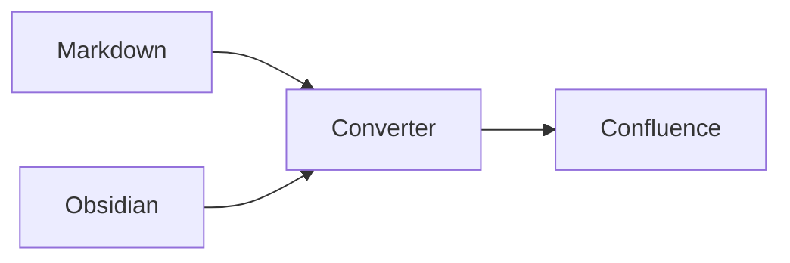
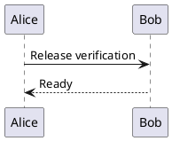

# Obsidian Media

Before the first image.

![[assets/blue.png|160]]

Between images.

After the images.

1. First list item
   - Nested image
     ![[assets/blue.png|80]]
2. Final list item

![[assets/sample.txt]]

![[assets/sequence.puml]]

## Adjacent images regression (#647)

Before adjacent image one.
![[assets/blue.png|80]]
After adjacent image one.

Before adjacent image two.

After adjacent image two.

End of adjacent image regression.
